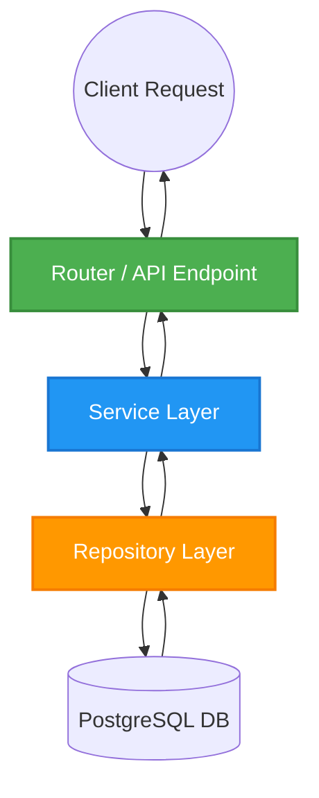
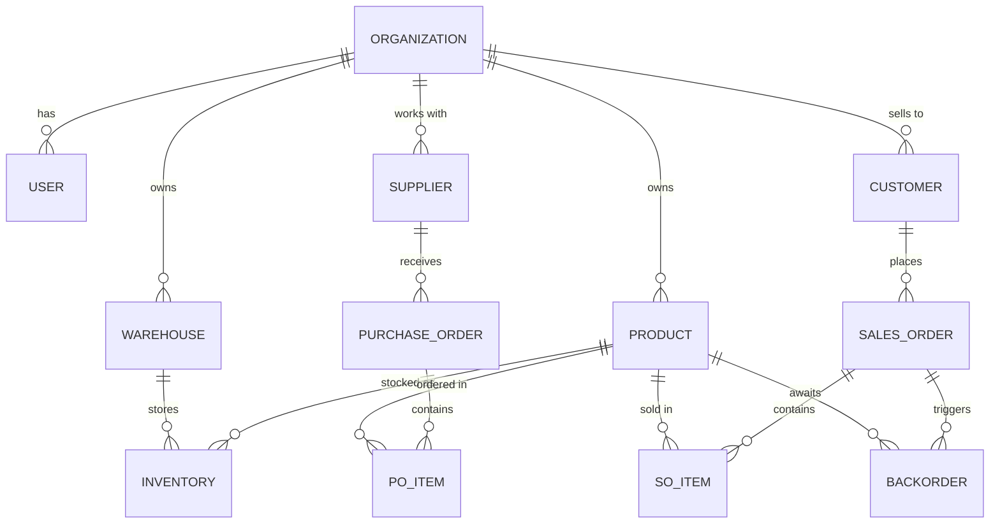
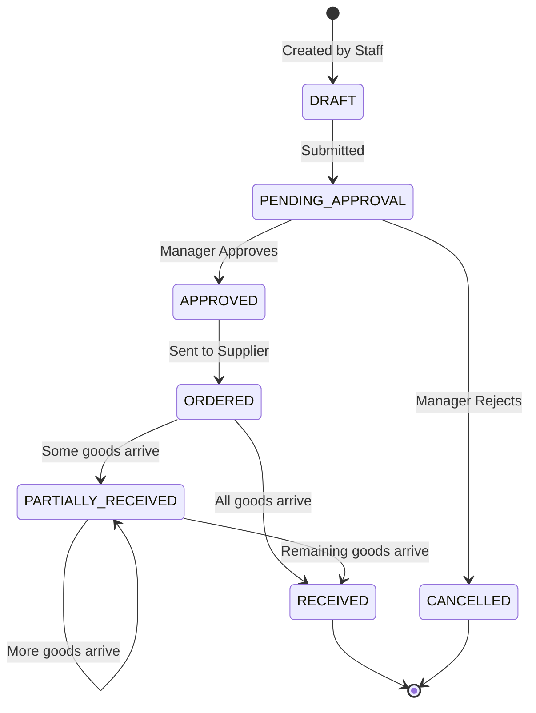
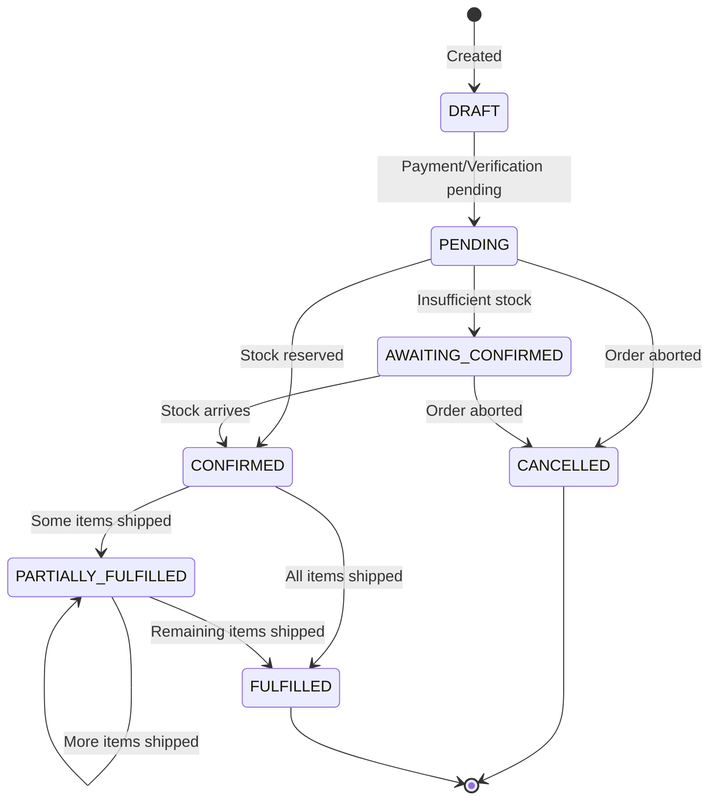
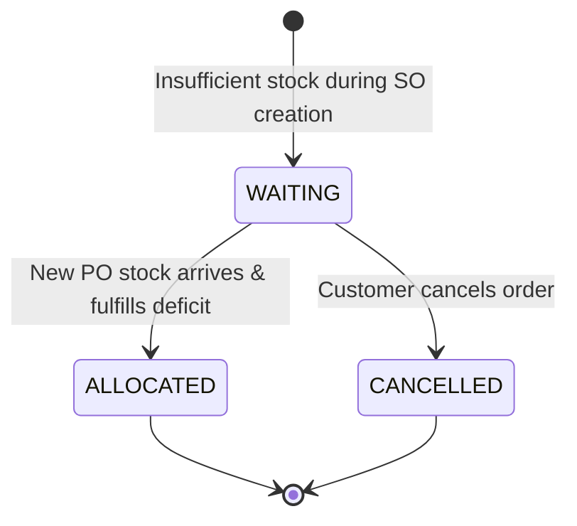
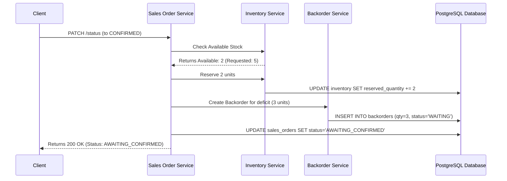
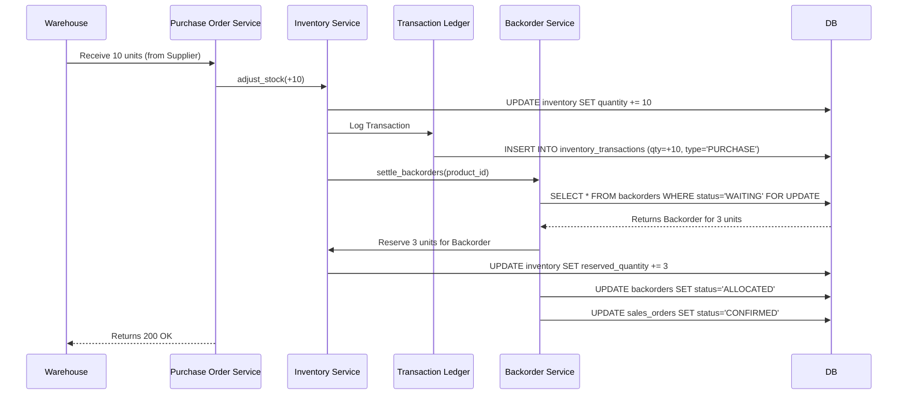

# IMS Workflow & Deep Dive Documentation

Welcome to the Multi-tenant SaaS Inventory Management System! This document serves as a comprehensive master guide for new engineers to understand the project's architecture, core workflows, database relationships, state transitions, and the deep technical mechanics of inventory and order management.

---

## 1. Project Overview

This project is a **Multi-tenant SaaS Inventory Management System** built with Python. It allows multiple independent organizations (tenants) to manage their inventory, procurement (Purchase Orders), sales fulfillment (Sales Orders), and unmet demand (Backorders) within a single deployed instance.

### Technology Stack

- **Framework**: FastAPI (Async)
- **Database**: PostgreSQL
- **ORM**: SQLAlchemy (Async)
- **Data Validation**: Pydantic v2
- **Migrations**: Alembic

---

## 2. System Architecture

The application strictly adheres to a **Layered (N-Tier) Architecture**. This separation of concerns ensures that business logic is independent of HTTP routing and database queries.

### Directory Structure & Responsibilities

| Directory               | Responsibility            | What you will find here                                                                                                             |
| :---------------------- | :------------------------ | :---------------------------------------------------------------------------------------------------------------------------------- |
| `app/api/v1/endpoints/` | **Controllers (Routers)** | FastAPI route definitions. Handles HTTP requests, authorization checks, and Pydantic schema validation. Delegates work to Services. |
| `app/services/`         | **Business Logic**        | The core brain of the app. Handles complex workflows, orchestrates multiple repositories, and enforces business rules.              |
| `app/repositories/`     | **Data Access**           | SQLAlchemy queries. Abstracts all SQL and ORM operations (CRUD) away from the service layer.                                        |
| `app/db/models/`        | **Database Entities**     | SQLAlchemy ORM models representing database tables and relationships.                                                               |
| `app/schemas/`          | **Pydantic Models**       | Data structures for validating incoming API requests payloads and formatting outbound responses.                                    |
| `app/dependencies/`     | **Dependency Injection**  | FastAPI`Depends` functions for injecting DB sessions, services, and checking authentication/authorization.                          |

---

## 3. Core Entities & Entity Relationship (ER) Diagram

At the heart of the system are **Organizations** and **Users**. Everything else (Products, Warehouses, Orders) belongs to an Organization.

---

## 4. Multi-Tenancy & Security

### Tenant Isolation

The system uses **Logical Isolation** (Row-level multi-tenancy).

- Every core entity (Product, Warehouse, Order, etc.) has an `organization_id`.
- The `current_user` dictionary injected into endpoints contains the user's `org_id`.
- The **Service Layer** and **Repository Layer** require `org_id` as a parameter for almost all operations. They automatically append `WHERE organization_id = :org_id` to queries to ensure a user can never read or modify another tenant's data.

### Role-Based Access Control (RBAC)

FastAPI dependencies are used to protect endpoints:

- `ALLOW_SUPER_ADMIN`: System-wide administrator (can approve new organizations).
- `ALLOW_ORG_ADMIN`: Organization owner (can manage users, settings).
- `ALLOW_ADMIN_OR_MANAGER`: Managers who can authorize Purchase Orders and manage catalogs.
- `ALLOW_COMMON_ORG`: Standard staff (can view inventory, fulfill orders).

---

## 5. The Core Philosophy: The Immutable Ledger

Inventory is strictly tracked using an immutable ledger (`inventory_transactions` table).

In many basic systems, inventory is just a `quantity` integer on a `Product` row that gets overwritten (`UPDATE products SET qty = qty - 5`). This approach is fragile and loses historical context.

Instead, this system uses an **immutable ledger pattern**:

- Every time physical stock is added, removed, or manually adjusted, a new row is inserted into the `inventory_transactions` table.
- The `inventory` table (which tracks quantities per warehouse per product per batch) is an *aggregate projection* of these transactions.
- **NEVER** update the `quantity` field in the `inventory` table directly. You must always use `InventoryService.adjust_stock()`, which will simultaneously update the physical aggregate quantity and log the transaction.

### Transaction Types

- **`PURCHASE`**: Positive delta. Logged when a Purchase Order is received.
- **`SALE`**: Negative delta. Logged when a Sales Order is physically shipped (fulfilled).
- **`ADJUSTMENT`**: Positive or negative delta. Used for manual corrections (e.g., discovering stolen goods, expired products, or auditing discrepancies).

---

## 6. Inbound Workflow: Purchase Orders (Procurement)

Purchase Orders (POs) manage the acquisition of new stock from **Suppliers**.

### 6.1 The PO Lifecycle

Used to buy stock from Suppliers. Managers must approve the PO before it is sent to the supplier. When goods arrive, they are "received", which increases Warehouse Inventory.

### 6.2 The Mechanics of Receiving Goods

When `PurchaseOrderService.received_order()` or `partially_received_order()` is called:

1. The system loops through every line item (`PurchaseOrderItem`).
2. It validates that the warehouse worker isn't trying to receive *more* than what was ordered.
3. It calls `InventoryService.adjust_stock()` with a positive `delta_quantity` and `transaction_type = PURCHASE`.
4. **The Ledger Entry**: A transaction is logged recording exactly who received the goods, the `unit_cost_snapshot` (for historical financial accuracy), and the PO reference ID.
5. **The Backorder Trigger**: If stock is successfully added, the inventory service alerts the `BackorderService`.

---

## 7. Outbound Workflow: Sales Orders (Fulfillment)

Sales Orders (SOs) represent formal commitments to supply goods to **Customers**. When an order is fulfilled, it deducts physical stock from the Warehouse.

### 7.1 The SO Lifecycle

### 7.2 The Mechanics of Reservation (Confirmation)

To prevent two customers from buying the same physical item, the system separates **Available Stock** from **Physical Stock**.
`Available Stock = physical_quantity - reserved_quantity`

When a Sales Order moves from `PENDING` to `CONFIRMED`:

1. The `SalesOrderService` loops through the line items.
2. It checks `Available Stock` via `InventoryService`.
3. If there is enough stock: It increments the `reserved_quantity` on the inventory batch. The physical stock hasn't left yet, but it can no longer be sold to anyone else.
4. If there is **NOT** enough stock: It reserves whatever *is* available, and then creates a **Backorder** for the deficit. The Sales Order status automatically becomes `AWAITING_CONFIRMED`.

### 7.3 The Mechanics of Fulfillment (Shipping)

When the goods actually leave the warehouse (`fulfill_order`):

1. The `SalesOrderService` calls `InventoryService.adjust_stock()` with a negative `delta_quantity` and `transaction_type = SALE`.
2. The physical `quantity` is permanently decremented.
3. The `reserved_quantity` that was holding the item is released (decremented) because the item has officially departed.

---

## 8. The Backorder Engine (Auto-Allocation)

The Backorder system acts as the bridge between Outbound Demand (Sales Orders) and Inbound Supply (Purchase Orders).

### 8.1 The Backorder Lifecycle

If a Sales Order is confirmed but there is insufficient physical stock in the warehouse, a **Backorder** is generated to track the deficit.

### 8.2 How Auto-Allocation Operates

1. **Creation**: Generated silently during Sales Order confirmation when demand exceeds supply. Status is `WAITING`.
2. **The Settlement Event**: Whenever a Purchase Order receives goods (via `adjust_stock`), the inventory service broadcasts a trigger: `settle_backorders(product_id)`.
3. **Auto-Allocation**:
   - The `BackorderService` grabs a **pessimistic lock** (`with_for_update()`) on all `WAITING` backorders for that product, ordered by their `expected_by` date (FIFO - First In, First Out).
   - It iterates through the waiting list, greedily reserving the newly arrived stock.
   - For each backorder fully satisfied, it changes the backorder status to `ALLOCATED`.
4. **State Promotion**: Once a backorder is `ALLOCATED`, the system checks the parent Sales Order. If the Sales Order has no more `WAITING` backorders, it automatically promotes the Sales Order from `AWAITING_CONFIRMED` to `CONFIRMED`, indicating it is finally ready for the warehouse team to pick and pack.

---

## 9. Visualizing the Mechanics

### 9.1 Sales Order Confirmation Sequence

This diagram shows the complex interplay when a customer orders a product that is out of stock.

### 9.2 The Auto-Allocation (Receiving) Sequence

This diagram shows what happens when the warehouse receives the missing goods from a supplier.

---

## 10. Concurrency and Race Conditions

In high-volume warehouses, multiple users might try to confirm Sales Orders or receive Purchase Orders at the exact same millisecond.

To prevent race conditions (e.g., two Sales Orders reserving the last remaining physical item), the application relies heavily on **Pessimistic Row-Level Locking**:

- Methods fetching inventory for deduction or reservation use `.with_for_update()`.
- This tells PostgreSQL to issue a `SELECT ... FOR UPDATE` lock on the specific rows.
- If Thread B attempts to access the same inventory row while Thread A is processing it, Thread B will block and wait at the database level until Thread A commits or rolls back its transaction.
- This guarantees absolute mathematical accuracy for inventory counts, at the cost of slight latency under extreme concurrent contention for the same specific product.
